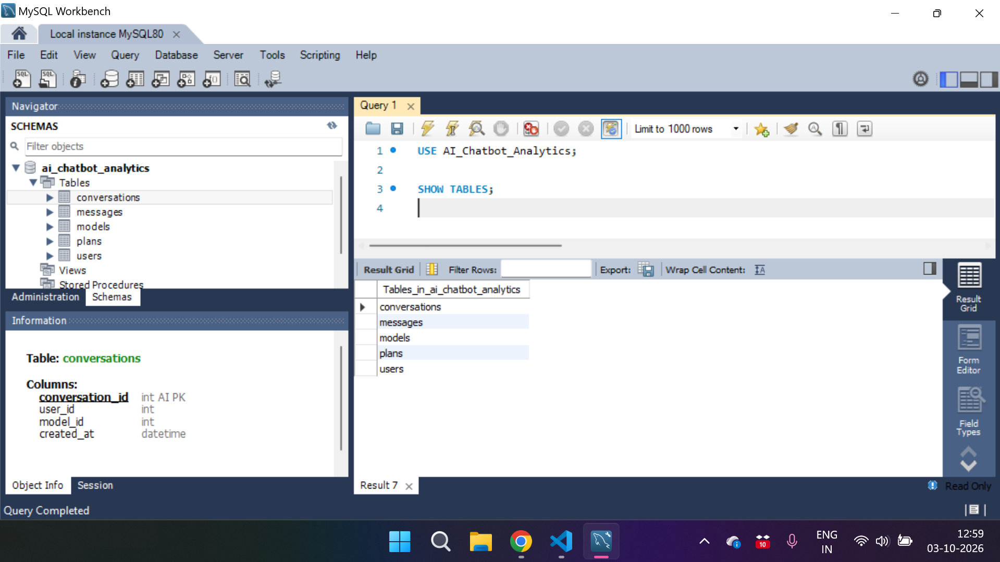
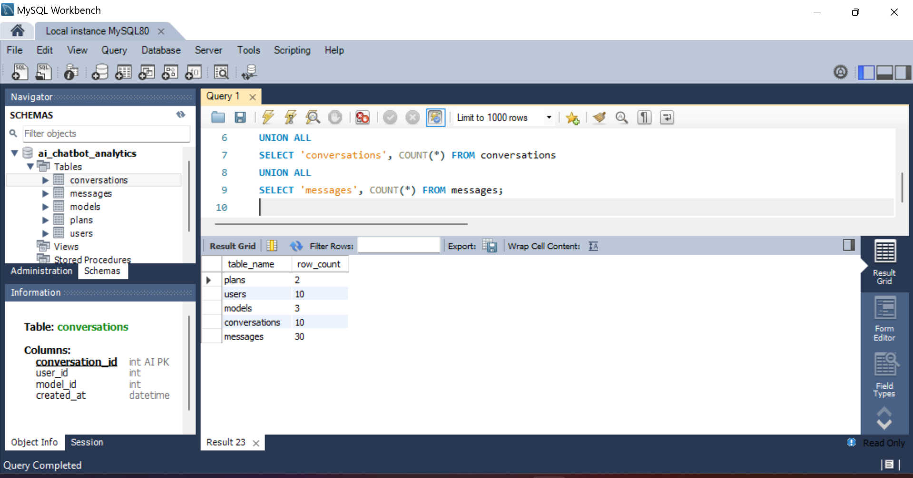
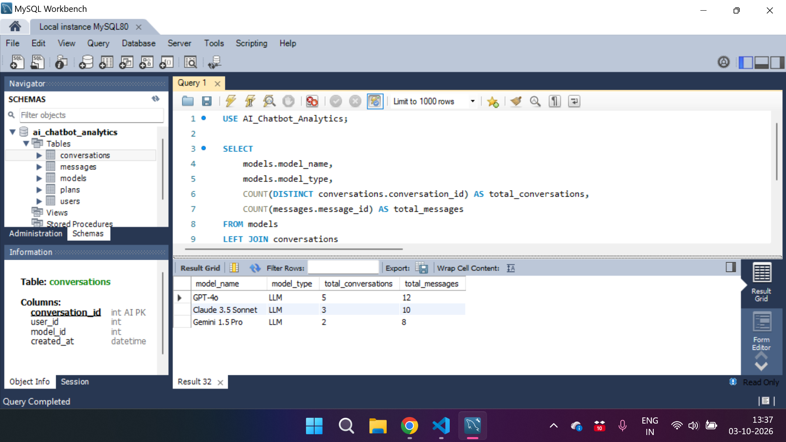
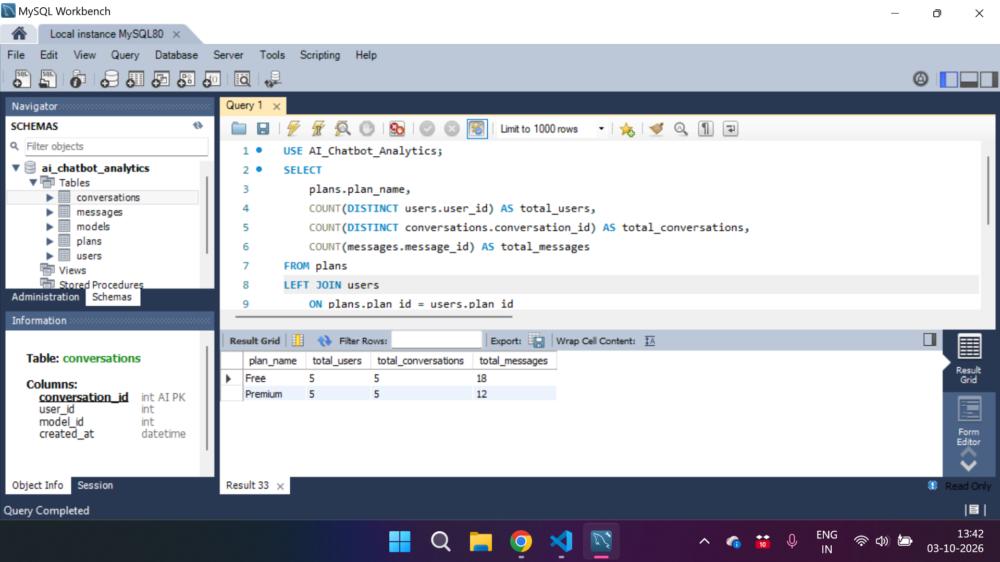

# 🤖 AI Chatbot Usage Analytics — SQL

> A relational database and SQL analytics project for an AI chatbot SaaS platform.


---

## 📌 Project Overview

This project simulates the database of an AI chatbot SaaS platform.

The database is designed to track:

- Users
- Subscription plans
- AI models
- Conversations
- Messages

SQL queries are used to analyze user activity, subscription distribution, conversation volume, message activity, and AI model usage.

The project demonstrates how a relational database can support analytics for an AI-powered SaaS application.

---

## 🎯 Project Objectives

The main objectives of this project are to:

- Design a relational database for an AI chatbot platform
- Create tables with appropriate relationships
- Store users, plans, AI models, conversations, and messages
- Perform SQL-based data analysis
- Use JOINs to combine information across tables
- Use aggregate functions for analytics
- Answer practical business questions using SQL
- Document the complete project for portfolio use

---

## 🏗️ Database Architecture

The database contains five main entities:

```text
                    ┌──────────────┐
                    │    Plans     │
                    └──────┬───────┘
                           │
                        plan_id
                           │
                           ▼
                    ┌──────────────┐
                    │    Users     │
                    └──────┬───────┘
                           │
                        user_id
                           │
                           ▼
                  ┌──────────────────┐
                  │  Conversations   │
                  └───────┬──────┬───┘
                          │      │
                    user_id      │ model_id
                          │      │
                          │      ▼
                          │  ┌──────────────┐
                          │  │    Models    │
                          │  └──────────────┘
                          │
                   conversation_id
                          │
                          ▼
                  ┌──────────────────┐
                  │     Messages     │
                  └──────────────────┘
```

---

## 🗂️ Database Tables

### 1. `users`

Stores information about platform users.

| Column | Description |
|---|---|
| `user_id` | Unique user identifier |
| `name` | User name |
| `email` | User email |
| `plan_id` | Subscription plan reference |

---

### 2. `plans`

Stores available subscription plans.

| Column | Description |
|---|---|
| `plan_id` | Unique plan identifier |
| `plan_name` | Name of the subscription plan |
| `price` | Plan price |

Current sample plans:

- Free
- Premium

---

### 3. `models`

Stores AI models available on the platform.

| Column | Description |
|---|---|
| `model_id` | Unique model identifier |
| `model_name` | AI model name |
| `model_type` | Type/category of model |

Sample models include:

- GPT-4o
- Claude 3.5 Sonnet
- Gemini 1.5 Pro

---

### 4. `conversations`

Stores chatbot conversations.

| Column | Description |
|---|---|
| `conversation_id` | Unique conversation identifier |
| `user_id` | User who created the conversation |
| `model_id` | AI model used |
| `created_at` | Conversation creation timestamp |

---

### 5. `messages`

Stores individual messages within conversations.

| Column | Description |
|---|---|
| `message_id` | Unique message identifier |
| `conversation_id` | Related conversation |
| `sender` | Message sender |
| `message` | Message content |

---

## 🔗 Table Relationships

The database uses primary keys and foreign keys to connect the entities.

```text
plans.plan_id
      ↓
users.plan_id

users.user_id
      ↓
conversations.user_id

models.model_id
      ↓
conversations.model_id

conversations.conversation_id
      ↓
messages.conversation_id
```

This relational structure allows information from multiple tables to be combined during analysis.

---

## 📊 Sample Dataset

The project uses a controlled sample dataset for demonstrating SQL analytics.

| Table | Records |
|---|---:|
| Plans | 2 |
| Users | 10 |
| Models | 3 |
| Conversations | 10 |
| Messages | 30 |

---

## 🔍 Business Questions

The project analyzes practical questions such as:

1. How many total users are registered?
2. How many users are on Free vs Premium plans?
3. How many users belong to each subscription plan?
4. Which AI model has the highest number of conversations?
5. How many conversations does each user have?
6. How many messages are present in each conversation?
7. Which users have the highest message activity?
8. How much usage does each AI model receive?
9. What percentage of users belong to each subscription plan?
10. What is the average number of messages per conversation?

### Detailed Analysis

For the complete list of questions, SQL queries, answers, dataset summary, and explanations:

👉 [View Business Questions & Analysis](queries/business_questions.md)

---

## 🧮 SQL Concepts Demonstrated

This project demonstrates the following SQL concepts:

- `SELECT`
- `WHERE`
- `COUNT()`
- `AVG()`
- `SUM()`
- `ROUND()`
- `ORDER BY`
- `GROUP BY`
- `INNER JOIN`
- `LEFT JOIN`
- `COUNT(DISTINCT ...)`
- Subqueries
- Primary Keys
- Foreign Keys

---

## 📈 Key Analysis Results

The analysis was performed using the project's sample dataset.

### User Distribution

```text
Free Users     → 5
Premium Users  → 5
Total Users    → 10
```

### AI Model Usage

The sample dataset contains conversations across:

```text
GPT-4o
Claude 3.5 Sonnet
Gemini 1.5 Pro
```

Model usage is analyzed using conversation and message counts.

### Message Activity

The dataset contains:

```text
30 total messages
10 conversations
```

The average number of messages per conversation is:

```text
3.00
```

For detailed query results, see:

👉 [Analysis SQL Queries](queries/analysis.sql)

👉 [Business Questions & Analysis](queries/business_questions.md)

---

## 📸 Project Screenshots

### 1. Database Structure



This screenshot shows the database structure and tables created for the AI chatbot analytics platform.

---

### 2. Sample Data Summary



This screenshot shows the sample data used during the SQL analysis.

---

### 3. SQL Analytics



This screenshot demonstrates the SQL queries used to analyze users, conversations, messages, subscription plans, and AI model usage.

---

### 4. Business Insights



This screenshot shows the final analytical results generated from the chatbot database.

---

## 📁 Project Structure

```text
AI-Chatbot-SQL-Analytics/
│
├── README.md
│
├── database/
│   ├── create_tables.sql
│   └── insert_data.sql
│
├── queries/
│   ├── analysis.sql
│   └── business_questions.md
│
└── results/
    └── screenshots/
        ├── README.md
        ├── SS1_Database_Structure.png
        ├── SS2_Sample_Data_Summary.png
        ├── SS3_SQL_Analytics.png
        └── SS4_Project_Insights.png
```

---

## ▶️ How to Run the Project

### Step 1 — Create the Database

Open MySQL Workbench or another MySQL client.

Run:

```sql
CREATE DATABASE AI_Chatbot_Analytics;
```

Then select the database:

```sql
USE AI_Chatbot_Analytics;
```

---

### Step 2 — Create the Tables

Open and execute:

```text
database/create_tables.sql
```

This creates the following tables:

```text
plans
users
models
conversations
messages
```

---

### Step 3 — Insert Sample Data

Open and execute:

```text
database/insert_data.sql
```

This populates the database with the project's sample dataset.

---

### Step 4 — Run the Analysis

Open:

```text
queries/analysis.sql
```

Execute the queries in MySQL Workbench to reproduce the project's analytics.

---

### Step 5 — Explore the Business Questions

Open:

```text
queries/business_questions.md
```

This file contains the analytical questions, SQL queries, answers, and explanations.

---

## 🛠️ Tools & Technologies

| Tool / Technology | Purpose |
|---|---|
| MySQL | Relational database |
| MySQL Workbench | Database development and SQL execution |
| SQL | Data querying and analysis |
| GitHub | Version control and project documentation |

---

## 💡 Skills Demonstrated

Through this project, I practiced:

- Relational database design
- Table creation
- Primary and foreign keys
- Data insertion
- SQL querying
- Data aggregation
- Multi-table JOINs
- `GROUP BY` analysis
- User activity analysis
- Subscription analysis
- AI model usage analysis
- Technical project documentation

---

## 🚀 Future Improvements

The project can be extended with:

- More realistic chatbot usage data
- Token consumption tracking
- API cost analysis
- Daily/monthly usage trends
- User retention analysis
- Subscription revenue analytics
- Query performance optimization
- SQL views for recurring reports
- Power BI/Tableau dashboard
- Python-based data analysis
- Automated analytics pipeline

---

## 📌 Project Status

**Completed — SQL Database & Analytics Project**

The current version focuses on relational database design and SQL-based analytics using a controlled sample dataset.

---

## 👨‍💻 Author

**Amrit Rai**

This project was created as part of my learning journey toward AI Engineering, with a focus on SQL, databases, and data analytics.

---

## ⭐ Project Highlights

```text
Database Design
      ↓
Sample Data
      ↓
SQL Queries
      ↓
JOIN & Aggregation
      ↓
Business Questions
      ↓
Analytics Results
      ↓
Documented Portfolio Project
```

If you found this project useful, feel free to explore the SQL files and analysis documentation.
